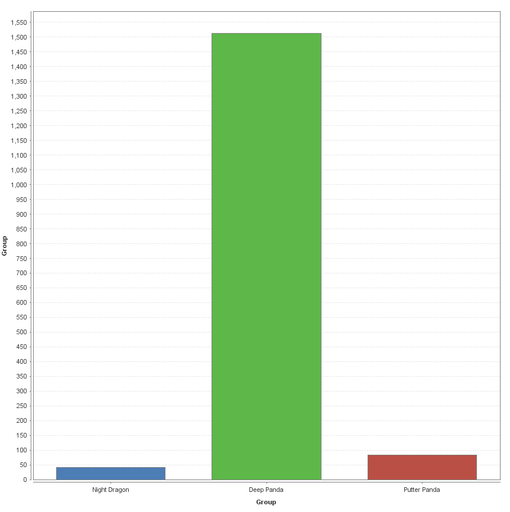
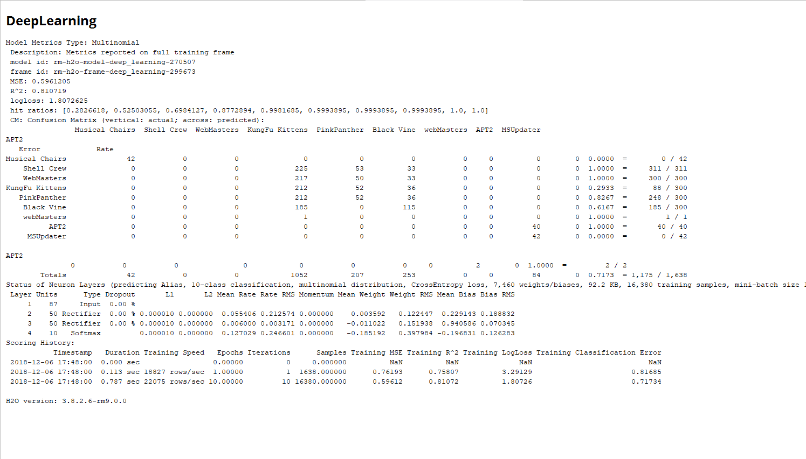
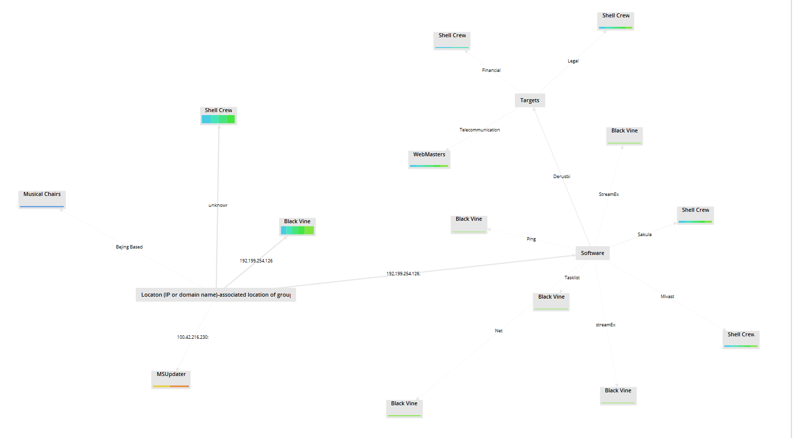

## IA 480: Detecting Chinese Cyber Actors

### The Problem

**_How to quickly identify likely cyber actors based on associated locations, targets, softwares, and techniques after an attack._**

This project's focus on cyber adversaries in China. Our aim was to identify and predict which techniques are most likely to be seen in future attacks among various cyber adversaries. We hope that this would allow an organization to quickly classify the likely cyber actors as information is collected specifying details of an attack. We collected all of our data from the not-for-profit think tank MITRE. MITRE collected their supplementary information and data from a variety of cybersecurity firms such as McAfee, RSA, and Crowdstrike. 

### The Data

Our data was compiled from the open-source data provided by [MITRE](https://attack.mitre.org/groups/)

From their data we created a spreadsheet that contained:
- The groups we were focused on
- Their known aliases
- The industries they typically target
- The software they are known to use
- Any specific techniques that they are known to use
- The location of the IP address typically associated with their attacks (if available)
- The known times of attacks

Our data utilized both Decision Tree and Deep Learning models. Decision Tree provided us an accuracy of 30.67% and a classification error of 69.33%. Deep Learning had an accuracy of 21.47% and a classification error of 78.53%. These accuracies represent the percent at which the model was able to predict the adversaries with the techniques, softwares, and associated locations. If a model has an accuracy which is too high this represents a model which is too complex for the provided data set. If  the model is overly complex, the testing data is going to be overly reliant on its training data and overconfident in its results. The model would then just be a visualization of the data from which it is learning from and would not be an accurate representation of new data and their most likely results. If the accuracy is too low then the model is not relying on training data at all and is overly simple. This type of model would not be able to generalize or capture all of the aspects of our data and therefore perform poorly in the results.

**The Dataset**

Our dataset was hand filled and contains the name, aliases, targets, softwares, techniques, location or IP address associated with the groups, as well as common times for the groups to attack. Not all the data could be found among the various groups. Between the three groups Night Dragon had information on common times associated with their attacks, whereas the others did not. In comparison, Deep Panda had a significant amount of IP addresses associated with them as well as much more alias than the other cyber adversaries.   

The actors of focus are Night Dragon, Deep Panda, and Putter Panda. Each group has a variety of associated aliases. Night Dragon is associated with the alias Musical Chairs. Deep Panda can also be associated with the names ShellCrew, WebMasters, KungFu Kittens, PinkPanther, and Black Vine. Putter Panda is commonly associated with the names APT2 and MSUpdater. 

The groups target a variety of different entities and are all known for utilizing different softwares. The techniques are the only common elements among the adversaries and when combined with each adversaries associated targets, softwares, and aliases, can be used as a means of identification in the future.  The common techniques found among the various groups include: File Deletion, Command-Line Interface, as well as Process Discovery. 

Night Dragon is known to target oil, gas, and petrochemical companies. Deep Panda targets various industries including governments, defense, financial, and telecommunication while Putter Panda targets space, satellites, and remote sensing technology. 

**Cyber Adversaries Counts**

### Trained Models
**Deep Learning**

[Deep Learning Model](DeepLearning/Deep_Learning_Process.xml)

**Decision Tree**

[Decision Tree Model](DecisionTree/Decision_Tree_Process.xml)

### Justification of the selection of models and parameters

Our reasoning for choosing the parameters we did was based on the data that we were able to obtain. Because we could not get sufficient data containing things such as IP addresses or financial impact we had to use the, mostly nominal, data that we had access to. This meant that our parameters were limited to those which would still be useful in following a decision tree model or in utilizing the deep learning model.

While the parameters we selected were those that we felt would be most useful for the models we had selected, we also selected the models based on the information that we were able to gather. Certain models could not be used, as they needed numerical data and the majority of our data was nominal. We did try several other models, but ultimately they provided little to no information that we felt would be helpful in actually solving our problem of figuring out potential cyber actors based on limited data that is likely still coming in.

### Our conclusion, the limitations of our research, and suggestions for future improvement

While building and testing our model we ran into a few unforeseen problems. It makes sense, In hindsight, for our model to have lower kappa and accuracy scores because of the data of choice. All information on the cyber actors was collected and utilized because the actors and their associated attacks are open source knowledge. Much of the critical information which would be useful in a machine learning model, such as ours, may not be easily accessible in the public domain. Cyber actors of interest, if successful, will not have a large amount of information known on their techniques, software utilized, and known IP address associations. If this knowledge is commonly known and easily accessible on the internet, it is assumed the actors would change associated techniques and methods for attacks, otherwise they would not be successful in the future. 

